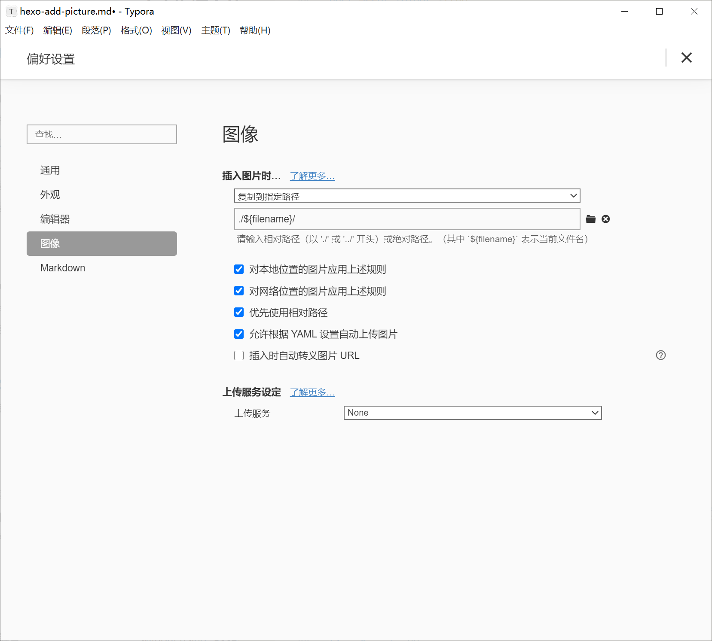

## 步骤

1. 安装 npm 依赖

    ```bash
    npm install hexo-simple-image --save
    npm install hexo-image-link --save
    ```

3. 修改 `_config.yml`

   ```yml
   post_asset_folder: true
   ```

5. 修改 Typora 设置

    文件→偏好设置


## 原理

1. ```yml
   post_asset_folder: true
   ```
   
   会在新建文章时自动创建一个同名文件夹，用于存放资源文件
   
2. hexo-simple-image 把Markdown的图片语法转换为 ``

   hexo-image-link 转换 hexo-simple-image 不正确的引用

3. Typora 设置后插入的图片会自动复制到资源文件夹

## 参考

[资源文件夹 | Hexo](https://hexo.io/zh-cn/docs/asset-folders.html)

[Hexo博客写作与图片处理的经验 - Cocowool - 博客园](https://www.cnblogs.com/cocowool/p/hexo-image-link.html)

[cocowool/hexo-image-link: 当MD中引用本地文件时，处理生成的html中的图片链接。](https://github.com/cocowool/hexo-image-link)

 